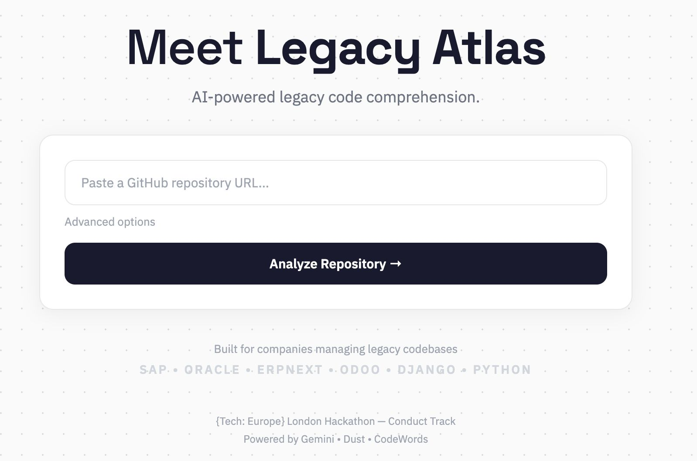
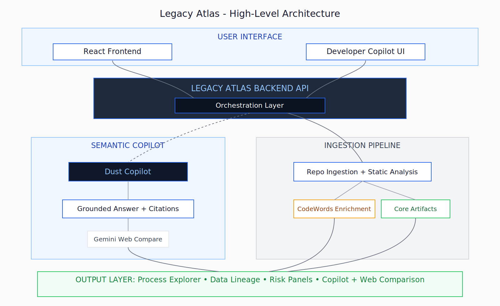

# Legacy Atlas

**AI-powered legacy code comprehension. Feed it a GitHub repo, get back process maps, data lineage, risk analysis, and a cited developer copilot.**

> Built for the [{Tech: Europe} London Hackathon](https://techeurope.io) — Conduct Track


---

## The Problem

70% of Fortune 500 software is over 20 years old. The original developers are gone, documentation is outdated, and every code change risks breaking something nobody understands. Companies spend billions trying to figure out what their own legacy systems actually do.

## What Legacy Atlas Does

Point it at a Python codebase and get four things back:

| Output | What It Shows |
|---|---|
| **Process Atlas** | Visual workflow maps extracted from code — what business processes exist and how they connect |
| **Data Lineage Navigator** | How entities (Customer → Order → Invoice) flow across modules |
| **Risk Observatory** | Complexity, coupling, dead code, and test gap scores with migration recommendations |
| **Developer Copilot** | Natural language Q&A with cited evidence — ask "what breaks if I change this?" and get line-level answers |

**Key differentiator:** Unlike process mining tools (Celonis, etc.) that need production event logs, Legacy Atlas works from source code alone. Just a GitHub URL. No system access, no runtime data, no integration required.

## How It Works
GitHub repo → Clone locally → Parse Python AST → Build workflow/lineage/risk graphs → AI semantic enrichment → Interactive UI

1. **Deterministic analysis first** — Python AST parsing extracts every function, class, import, call graph, entity, and CRUD operation. No AI hallucinations in the structural layer.
2. **AI interpretation second** — Dust powers grounded copilot answers and CodeWords enrichment adds ontology and migration hints.
3. **Every claim is traceable** — click any node and see the exact file, function, and line number.

## Partner Technologies

| Partner | Role |
|---|---|
| **CodeWords** | Post-analysis runtime workflow for semantic enrichment and migration hints |
| **Dust** | Primary semantic copilot engine for grounded answers and citations |
| **Gemini (Google DeepMind)** | External web comparison add-on for Reddit/X references |

### How Each Integration Is Used

- **CodeWords**
  - Runs automatically after static analysis in backend job flow.
  - Adds semantic enrichment (ontology + migration hints + quality checks) to each run.
  - Powers the AI Enrichment section and improves migration-oriented context.
- **Dust**
  - Main semantic engine for Developer Copilot answers.
  - Receives run context (workflow graph, risk findings, evidence, enrichment) and returns grounded answer + citations + implications.
  - If unavailable, backend falls back to deterministic local copilot logic.
- **Gemini**
  - Secondary add-on after copilot answer (`/api/copilot/web-compare` endpoint).
  - Finds external discussions (Reddit/X) similar to the copilot recommendation.
  - Displayed in a separate “Web Comparison” card with links and short rationale, complementing internal analysis.

## Architecture



| Layer | Stack | Port |
|---|---|---|
| Backend | FastAPI + Python 3.12 | 8000 |
| Frontend | React 18 + TypeScript + Vite | 5173 |
| Storage | SQLite | — |
| AI | Dust (semantic copilot), CodeWords (enrichment), Gemini (web comparison) | External |

### Analysis Pipeline
Register repo → Start scan → Ingest source → Parse Python AST → Build graphs → Score risks → Persist artifacts → Complete

Two analysis modes:
- **ast-local**: Real Python AST parsing with cyclomatic complexity, call graphs, entity recognition, CRUD detection
- **fallback**: Heuristic placeholders when local source is unavailable

### Risk Scoring

Four categories scored across four severity levels:

| Category | What It Detects |
|---|---|
| Complexity | High cyclomatic complexity, deeply nested logic |
| Coupling | Tight interdependencies between modules |
| Dead Code | Unreachable functions and unused imports |
| Test Gap | Critical business logic without test coverage |

Each finding includes **migration suggestions** — actionable recommendations for modernization (e.g., "Refactor into smaller functions", "Introduce interface boundary", "Add unit tests for critical paths").

## Quick Start

### 1) Create env files
```bash
cp apps/api/.env.example apps/api/.env
cp apps/web/.env.example apps/web/.env
```

### 2) Run API
```bash
cd apps/api
pip install -e .
uvicorn app.main:app --reload --port 8000
```

The API auto-loads `apps/api/.env` at startup (without overwriting env vars already exported in your shell).

### 3) Run web app
```bash
cd apps/web
npm install
npm run dev
```

### 4) Analyze a repo

Open [http://localhost:5173](http://localhost:5173). For real AST analysis, clone a repo locally and provide the path in the **Local Repo Path** field:
```bash
git clone https://github.com/KoalixSwitzerland/koalixcrm.git
# Then enter /path/to/koalixcrm as Local Repo Path in the UI
```

Or use Make:
```bash
make api-install && make api-run    # Terminal 1
make web-install && make web-run    # Terminal 2
make api-smoke                      # Backend smoke flow (no frontend required)
```

## API Endpoints (16)

| Endpoint | Purpose |
|---|---|
| `POST /api/repos/register` | Register a GitHub repository |
| `POST /api/repos/{id}/scan` | Queue async analysis |
| `GET /api/repos/{id}/runs/{id}` | Poll run status and progress |
| `GET /api/runs/{id}/workflow-graph` | Process workflow graph |
| `GET /api/runs/{id}/lineage-graph` | Data lineage graph |
| `GET /api/runs/{id}/risk-summary` | Risk findings with migration suggestions |
| `GET /api/runs/{id}/node/{id}/evidence` | Evidence for a specific graph node |
| `GET /api/runs/{id}/enrichment` | Persisted CodeWords ontology/migration enrichment |
| `GET /api/runs/{id}/migration-blueprint` | Execution-ready migration blueprint |
| `POST /api/copilot/query` | AI copilot with cited answers |
| `GET /api/integrations/dust/status` | Dust configuration status |
| `GET /api/integrations/mcp/status` | MCP server discovery |
| `GET /api/integrations/readiness` | Integration configured/reachable readiness |
| `POST /api/integrations/codewords/trigger` | Trigger CodeWords workflow |
| `GET /api/integrations/codewords/result/{id}` | Poll CodeWords result |
| `GET /health` | Service health check |

## Frontend Components

| Component | What It Does |
|---|---|
| **RepoIntakePanel** | Repo URL input + 5-step pipeline tracker + Dust/CodeWords status badges |
| **GraphPanel** (x2) | Interactive SVG graph with node inspector and evidence drill-down |
| **RiskPanel** | Risk score dashboard with severity badges and migration suggestions |
| **CopilotPanel** | AI Q&A with file/symbol/line citations, risk implications, related nodes |

- `POST /api/repos/{repo_id}/scan` queues a run and returns immediately.
- Frontend polls `GET /api/repos/{repo_id}/runs/{run_id}` for `status`, `current_step`, and `progress_pct`.
- Artifacts persist in SQLite at `data/legacy_atlas.db`.
- `run.summary` includes additive `ontology`, `migration`, `codewords_runtime`, required analysis counters, and `ingestion_branch` telemetry for downstream UI/agents.
- `GET /api/runs/{run_id}/enrichment` exposes normalized CodeWords enrichment (`ontology_enrichment`, `migration_hints`, `quality_checks`).
- `GET /api/runs/{run_id}/migration-blueprint` exposes phased migration guidance from run artifacts.
- `GET /api/integrations/readiness` exposes `configured/reachable/latency` health for Dust, CodeWords, and MCP.

## Environment Variables

| Variable | Purpose |
|---|---|
| `DUST_API_KEY` | Dust API key for semantic copilot |
| `DUST_WORKSPACE_ID` | Dust workspace identifier |
| `DUST_ASSISTANT_CONFIGURATION_ID` | Dust assistant for copilot responses |
| `DUST_API_BASE_URL` | Dust API base URL (default `https://dust.tt/api/v1`) |
| `CODEWORDS_API_KEY` | CodeWords runtime API key |
| `CODEWORDS_RUNTIME_BASE_URL` | CodeWords runtime base URL |
| `CODEWORDS_RUNTIME_SERVICE_ID` | CodeWords runtime service id used by post-analysis hook (default: `legacy_atlas_post_analysis_v1_8a477024`; use runtime id, not display title) |
| `CODEWORDS_POLL_MAX_ATTEMPTS` | Max poll attempts for async CodeWords runtime job |
| `CODEWORDS_POLL_INTERVAL_SEC` | Poll interval in seconds for CodeWords runtime job |
| `LEGACY_ATLAS_REPO_CACHE` | Local clone cache directory |
| `LEGACY_ATLAS_REPO_ROOTS` | Optional local roots for repo discovery fallback |
| `LEGACY_ATLAS_ENABLE_GIT_INGESTION` | Set to `0` to disable remote clone |
| `LEGACY_ATLAS_SYNC_JOBS` | Set to `1` for inline analysis (tests) |
| `LEGACY_ATLAS_CODEWORDS_RUNTIME_HOOK` | Set to `0` to disable post-analysis CodeWords trigger/poll |
| `LEGACY_ATLAS_LOG_LEVEL` | Runtime logging level (`DEBUG`, `INFO`, `WARNING`, ...) |
| `LEGACY_ATLAS_AST_PROGRESS_EVERY` | Log AST scan progress every N Python files |
| `LEGACY_ATLAS_CORS_ORIGINS` | Comma-separated CORS allowlist (default localhost web dev ports) |

To watch analysis internals live in terminal, start API with:

```bash
cd apps/api
LEGACY_ATLAS_LOG_LEVEL=DEBUG uvicorn app.main:app --reload --port 8000
```

## Tests
```bash
cd apps/api
pip install -e .[dev]
pytest
```

The test suite covers health check, end-to-end scan + graph generation, migration blueprint endpoint, manual API flow parity, Dust fallback matrix, copilot paths, ingestion branch resolution, API error detail codes, MCP/Dust status, integrations readiness, and fallback mode.

## Repository Structure
```
apps/
  api/                  # FastAPI backend (Python 3.12)
    app/
      routers/          # API endpoint handlers
      services/         # Analysis engine, Dust client, Gemini client, CodeWords client
      persistence/      # SQLite storage layer
      integrations/     # MCP configuration
    tests/              # Integration tests
  web/                  # React + TypeScript frontend (Vite)
    src/
      components/       # UI panels (Graph, Risk, Copilot, Intake)
      lib/              # API client and types
```

## Post-Hackathon Roadmap

- PHP and JavaScript language adapters
- Revision diff engine for architecture drift over time
- Migration readiness index (composite modernization score)
- Runtime trace integration to validate static analysis
- Pilot with production legacy system

## Team

Built by **Alessandro Condorelli** and **Maxime Brun** — London Business School

## License

MIT
