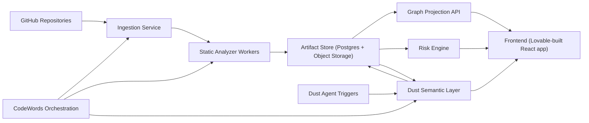
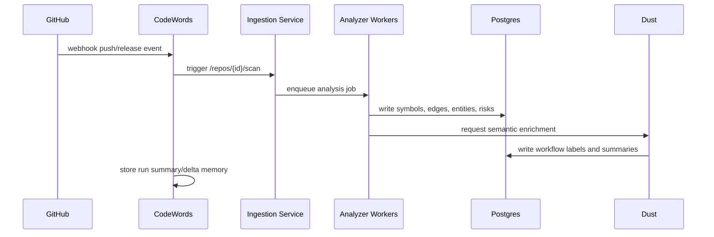
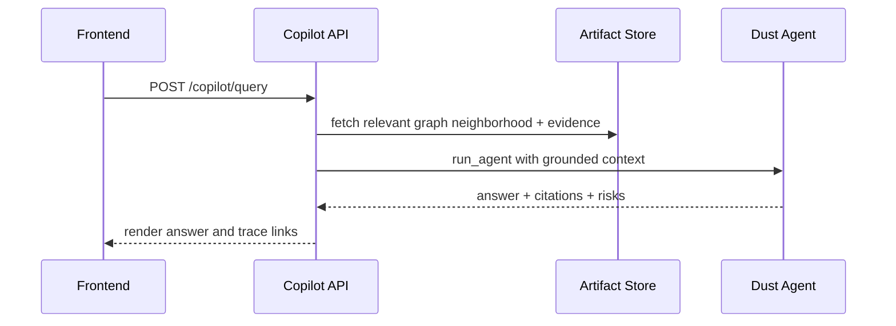

# Legacy Atlas Architecture and Data Model

## 1) System Topology



## 2) Component Breakdown

### A. Ingestion Service

Responsibilities:

- Register repositories and revisions
- Clone or fetch source snapshot
- Detect language and framework
- Emit analysis jobs

APIs:

- `POST /api/repos/register`
- `POST /api/repos/{repo_id}/scan`
- `GET /api/repos/{repo_id}/runs/{run_id}`

### B. Static Analyzer Workers

Responsibilities:

- Parse ASTs
- Extract symbol graph
- Build dependency graph
- Detect ORM models and schema relationships
- Identify CRUD pathways

Output:

- Normalized analysis artifacts into database and object storage.

### C. Risk Engine

Responsibilities:

- Compute complexity and coupling metrics
- Identify hotspot files
- Flag dead code candidates
- Compute migration readiness score

### D. Dust Semantic Layer

Responsibilities:

- Label technical workflows as business processes
- Summarize modules and functions
- Generate risk annotations with evidence links
- Power copilot question answering on indexed artifacts

### E. Graph Projection API

Responsibilities:

- Serve process graph and lineage graph queries
- Return neighborhood expansion quickly
- Aggregate risk overlays per node and edge

### F. Frontend App

Responsibilities:

- Interactive graph exploration
- Health and risk dashboard
- Copilot chat with evidence drill down
- Compare revisions

### G. CodeWords Orchestration Layer

Responsibilities:

- Event triggers from webhooks and schedules
- Start and monitor analysis workflows
- Persist run memory and deltas
- Dispatch post-run Dust semantic jobs

## 3) Data Contracts (Canonical Schemas)

```sql
create table repositories (
  id uuid primary key,
  provider text not null,                 -- github
  owner text not null,
  name text not null,
  default_branch text not null,
  created_at timestamptz not null default now()
);

create table analysis_runs (
  id uuid primary key,
  repository_id uuid not null references repositories(id),
  commit_sha text not null,
  status text not null,                   -- queued|running|completed|failed
  started_at timestamptz,
  finished_at timestamptz,
  summary jsonb not null default '{}'
);

create table symbols (
  id uuid primary key,
  run_id uuid not null references analysis_runs(id),
  language text not null,                 -- python
  symbol_type text not null,              -- module|class|function|method|model
  name text not null,
  qualified_name text not null,
  file_path text not null,
  line_start int not null,
  line_end int not null,
  metadata jsonb not null default '{}'
);

create table symbol_edges (
  id uuid primary key,
  run_id uuid not null references analysis_runs(id),
  from_symbol_id uuid not null references symbols(id),
  to_symbol_id uuid not null references symbols(id),
  edge_type text not null,                -- imports|calls|inherits|references
  confidence numeric(4,3) not null default 1.0
);

create table entities (
  id uuid primary key,
  run_id uuid not null references analysis_runs(id),
  name text not null,                     -- Customer, Order, Invoice
  source_model text not null,
  metadata jsonb not null default '{}'
);

create table lineage_edges (
  id uuid primary key,
  run_id uuid not null references analysis_runs(id),
  entity_from_id uuid not null references entities(id),
  entity_to_id uuid not null references entities(id),
  operation text not null,                -- create|read|update|delete|transform
  via_symbol_id uuid references symbols(id),
  confidence numeric(4,3) not null,
  evidence jsonb not null default '[]'
);

create table workflow_nodes (
  id uuid primary key,
  run_id uuid not null references analysis_runs(id),
  label text not null,                    -- Sales Confirmation
  node_type text not null,                -- process|decision|data_transform
  symbol_ids uuid[] not null default '{}',
  summary text,
  risk_score numeric(5,2) not null default 0
);

create table workflow_edges (
  id uuid primary key,
  run_id uuid not null references analysis_runs(id),
  from_node_id uuid not null references workflow_nodes(id),
  to_node_id uuid not null references workflow_nodes(id),
  edge_type text not null,                -- control|data
  weight numeric(5,2) not null default 1
);

create table risk_findings (
  id uuid primary key,
  run_id uuid not null references analysis_runs(id),
  symbol_id uuid references symbols(id),
  category text not null,                 -- complexity|coupling|dead_code|test_gap
  severity text not null,                 -- low|medium|high|critical
  score numeric(5,2) not null,
  rationale text not null,
  evidence jsonb not null default '[]'
);
```

## 4) Workflow Extraction Algorithm (Design)

Goal:

- Convert low-level code structure into meaningful business workflow graphs.

Pipeline:

1. Build call graph and module dependency graph.
2. Identify entrypoints and orchestration methods:
   - HTTP handlers
   - service-layer methods
   - scheduled tasks
3. Trace downstream call subgraphs with depth/branch limits.
4. Group symbols into candidate workflow clusters using:
   - shared entities
   - co-change locality
   - naming embeddings
5. Label clusters:
   - deterministic labels from known ERP lexicon
   - Dust semantic relabeling pass for clarity
6. Emit workflow nodes and edges with confidence scores.

Pseudo:

```text
for entrypoint in entrypoints:
    subgraph = bounded_dfs(call_graph, entrypoint, depth=10)
    entity_hits = map_entities(subgraph)
    cluster = cluster_symbols(subgraph, entity_hits, naming_vectors)
    label = semantic_label(cluster, entity_hits)
    write_workflow(cluster, label)
```

## 5) Data Lineage Mapping Algorithm (Design)

Goal:

- Show how business entities move and change across modules.

Pipeline:

1. Detect entity models from ORM declarations.
2. Detect CRUD operations in methods:
   - model create/save/update/delete patterns
   - SQL execution patterns
3. Build operation triplets:
   - source entity
   - operation
   - destination entity or sink
4. Link operation edges to calling workflow nodes.
5. Score confidence from evidence strength:
   - explicit ORM access > inferred string match.

Pseudo:

```text
for symbol in symbols:
    ops = extract_crud_ops(symbol.ast)
    for op in ops:
        edge = infer_lineage(op, symbol, entity_catalog)
        edge.confidence = score(edge.evidence)
        persist(edge)
```

## 6) API Surface for Frontend and Copilot

Graph and risk:

- `GET /api/runs/{run_id}/workflow-graph`
- `GET /api/runs/{run_id}/lineage-graph`
- `GET /api/runs/{run_id}/risk-summary`
- `GET /api/runs/{run_id}/node/{node_id}/evidence`

Copilot:

- `POST /api/copilot/query`
  - input: `question`, `run_id`, optional `focus_node_id`
  - output: `answer`, `citations[]`, `risk_implications[]`, `related_nodes[]`

## 7) End-to-End Interaction Sequences

### Sequence: Analysis Run



### Sequence: User asks copilot question



## 8) Scaling Plan (Post-MVP)

1. Add language adapters (PHP, JS) behind a shared analyzer interface.
2. Add incremental re-analysis by file diff to reduce runtime.
3. Add graph database cache if traversal latency grows.
4. Add runtime traces from logs to validate static inference.

